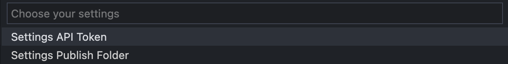

# Thrust 

The Thrust extension helps Web Developers quickly and easily publish their static websites to IPFS & Filecoin blockchain network using [Web3 Storage](https://web3.storage) service maintained by [Protocol Labs](https://protocol.ai).

## How to use Thrust

1. ### Creating a Web3 Storage account
    Go to [https://web3.storage/login](https://web3.storage/login) and create your own **Web3 Storage** account. Now, you will have **1 TB** of free space to host your static websites.

2. ### Getting a Web3 Storage API token
   After you have an account in the above step, you need to
 create an API token to use Thrust extension. Go to [https://web3.storage/account](https://web3.storage/account), then click **Create an API token** to generate a new API token. 

    **Attention**: *Please keep your **Web3 Storage** API token private and make sure you keep it in a secure place where you can copy whenever needed.*

3. ### Settings your Web3 Storage API token and Publish Folder
   You can find the Thrust settings in [VS Code's Command Palette](https://code.visualstudio.com/docs/getstarted/tips-and-tricks#_command-palette). 
   
   

    Now, choose the Thrust Settings Command and complete 2 settings. 

   

    In the settings, the API Token is the **Web3 Storage** API token you created in the **Step 2**, and the Publish Folder is your folder containing the static website code that you need to publish.

4. ### Publish your static website    
    After completing the settings in the **Step 3**, now you can publish your static website easily by choosing to run ***thrust.publish*** command in the VS Code's Command Palette.

    

    The publishing takes some time to process, please wait patiently for a moment.

    
    After successful publishing, Thrust gives you the [CID](https://docs.ipfs.io/concepts/content-addressing/#content-addressing-and-cids) of your static website and you can access it from anywhere on the Internet. You can also find all the previously published static websites at [https://web3.storage/files](https://web3.storage/files).

## License
Click the following hyperlink to view the license.
* [MIT License](https://github.com/iamvon/thrust-vscode-extension/blob/main/LICENSE)

## For more information

You can checkout the source code and contribute on:

* [thrust-vscode-extension](https://github.com/iamvon/thrust-vscode-extension)

**Enjoy!**